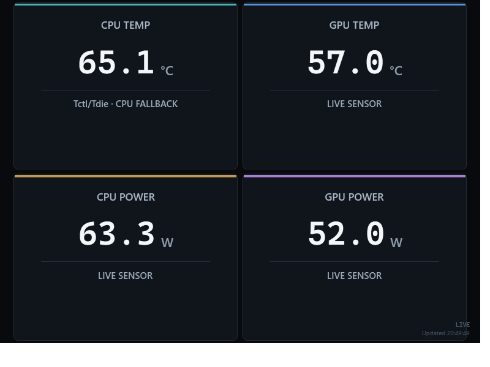

# Stats Screen

Stats Screen is a purpose-built .NET 8 WPF dashboard for an 800 × 600 secondary display. Version 0.2.0 reads four live values through `LibreHardwareMonitorLib`:

- maximum available CPU core temperature
- main GPU core temperature
- CPU package power
- total GPU board/package power

The UI is a purpose-built instrumentation display: temperatures dominate the upper half, power sits below, and detected CPU/GPU names form a compact status strip. Sensor polling is kept off the WPF UI thread, and a missing sensor is displayed as `N/A` rather than treated as a fatal error.

[Download the Windows installer for Stats Screen 0.2.0](https://github.com/Bonkerz80/StatsScreen/releases/latest/download/StatsScreen-Setup-0.2.0.exe)



## Install and first run (0.2.0)

Download and run `StatsScreen-Setup-0.2.0.exe`, or run `artifacts/installer/StatsScreen-Setup-0.2.0.exe` after building locally. The installer includes the .NET runtime, installs to Program Files, creates a Start menu entry, and offers a desktop shortcut (selected by default).

**Start with Windows** is optional and initially unchecked. It creates a scheduled task for the account running setup with interactive sign-in and administrator privileges; no password is stored. Run setup again and change the checkbox to enable/disable it. For an account using different administrator credentials, the startup task belongs to that administrator account.

Manual launches ask for administrator access, which is needed for CPU readings on the tested PC. Setup includes signed PawnIO 2.2.0 and installs it only when missing or older. Uninstall keeps shared PawnIO and your settings/logs.

The installed application is unsigned. Windows may show an unknown-publisher notice. The bundled third-party driver installer is signed; these are separate signatures.

CPU fallback readings are visibly labelled `Tctl/Tdie · CPU FALLBACK`. Numbered cores take precedence whenever exposed. The AMD integrated graphics and discrete RX 9070 XT are distinguished by hardware name, with deterministic selection that does not change when a reading is temporarily missing. Unknown GPUs still need validation against their logs.

### Rebuild setup

With .NET 8 SDK, Inno Setup 6.7.3, and `installer/vendor/PawnIO_setup.exe` (official signed 2.2.0) present:

```powershell
.\build-installer.ps1
```

Use `-DotNet <path-to-dotnet.exe>` and `-InnoCompiler <path-to-ISCC.exe>` for tools outside PATH/default locations. Build output is under `artifacts/`. The installer source is `installer/StatsScreen.iss`.

### Automated GitHub builds

Pull requests and pushes to `main` run the test suite automatically. To publish a new installer, update the version in `StatsScreen.csproj`, `installer/StatsScreen.iss`, and `installer/setup-info.txt`, update `RELEASE_NOTES.md`, then push a matching tag such as `v0.2.1`:

```powershell
git tag v0.2.1
git push origin v0.2.1
```

GitHub Actions validates the tag, downloads the official signed PawnIO 2.2.0 setup package with a pinned SHA256 check, builds the self-contained x64 installer, uploads it as a workflow artifact, and creates the GitHub release automatically. A manual workflow run can build and upload an installer artifact without publishing a release.

### Build the application

From the repository directory:

```powershell
dotnet restore .\StatsScreen.sln
dotnet build .\StatsScreen.sln -c Release
dotnet test .\tests\StatsScreen.Tests\StatsScreen.Tests.csproj -c Release
```

The project targets `net8.0-windows` and uses the stable `LibreHardwareMonitorLib` 0.9.6 package.

To publish a standalone 64-bit executable:

```powershell
dotnet publish .\src\StatsScreen\StatsScreen.csproj `
  -c Release -r win-x64 --self-contained true `
  -p:PublishSingleFile=true -p:IncludeNativeLibrariesForSelfExtract=true
```

The published files are placed under `src\StatsScreen\bin\Release\net8.0-windows\win-x64\publish`.

## Verification

The release was checked against the target PC with real elevated sensor readings, the optional sign-in task, installation, reinstallation, and uninstall. See [VERIFICATION.md](VERIFICATION.md) for the observed results and remaining environment-dependent checks.

## Run and controls

Run `StatsScreen.exe` normally while developing. The initial window is a normal, resizable debug window. The dashboard is designed at a 4:3 ratio and remains free of scrolling.

- `F2` opens display settings.
- `F11` enters or exits dedicated display mode.
- `Esc` exits dedicated display mode.

Dedicated display mode is borderless, topmost, and fills the remembered monitor bounds. Settings are stored at `%LOCALAPPDATA%\StatsScreen\settings.json`. The diagnostic log is written to `%LOCALAPPDATA%\StatsScreen\logs`.

The monitor selector shows the current bounds of every Windows display. Select the 800 × 600 monitor and enable **Start in dedicated display mode** if the dashboard should enter that mode on launch.

## Hardware monitoring

`HardwareMonitorService` owns the Libre Hardware Monitor `Computer` instance and is the only component that talks directly to the library. It enables CPU and GPU hardware, opens the library once, updates the hardware tree on a background polling loop, and converts the library objects into application-level sensor descriptors.

`SensorSelection` contains the name/type rules. CPU temperature selection first considers explicitly numbered/core-named temperature sensors and takes the highest current value. Only when no individual core sensor is exposed does it consider common AMD aggregate names such as `Tctl/Tdie`, followed by package/CPU temperature fallbacks. This prevents a package value from winning when individual cores are present.

CPU power selection uses CPU `Power` sensors and known package/total names while excluding per-core, limit, rail, and other non-total sensors. GPU selection prefers known discrete hardware names, then chooses core temperature and total board/package power on that same GPU. SoC and voltage-regulator readings cannot stand in for GPU core/board readings. Selection uses names and hardware order, not changing values.

## Hardware checks on the target PC

Libre Hardware Monitor may expose different names depending on the CPU, GPU driver, firmware, and permissions. Check the diagnostic log after the first run for:

- whether individual CPU core temperatures are present
- whether the GPU reports a core temperature
- whether CPU package power is exposed
- whether a total GPU board/package power sensor is exposed
- whether the process needs to be run elevated for the target machine

The application requests administrator privileges explicitly through its manifest. Unsupported or unreadable sensors still show N/A. Successful compilation alone does not verify hardware support.

Diagnostic mode uses real hardware, displays the dashboard for eight samples, writes readings and UI values, saves a rendered preview, and exits:

```powershell
StatsScreen.exe --diagnose "C:\path\to\diagnostics"
```

## Project layout

```text
src/StatsScreen/
  Models/              application-level snapshots and sensor descriptors
  Services/            hardware, polling, display, settings, and logging
  ViewModels/           dashboard presentation state
  Views/               WPF dashboard, tiles, and settings window
  Themes/              dashboard styling
tests/StatsScreen.Tests/
  SensorSelectionTests.cs
```

The test project is kept beside the application solution so the normal solution build stays focused on the Windows desktop executable; run it directly with the command above.

The selection code is intentionally independent of the Libre Hardware Monitor object graph, which makes the most important sensor rules easy to test and extend when the target PC is known.
